# Refined Application Flow Overview

## Core Workflow

```mermaid
graph TB
    subgraph Hedge_Fund_System
        SA[Supervisor Agent]
        Error[Error Handler]
        Logger[Logging System]
        Monitor[System Monitor]
    end

    subgraph Data_Collection
        API[Financial Datasets API]
        Market[Market Data Agent]
        Raw_DB[(MongoDB: Raw Data)]
        Cache[(Redis Cache)]
        
        API --> Market
        Market --> Raw_DB
        Market --> Cache
    end

    subgraph Analysis_Agents
        Tech[Technical Analyst]
        Fund[Fundamentals Agent]
        Sent[Sentiment Agent]

        Raw_DB --> Tech
        Raw_DB --> Fund
        Raw_DB --> Sent
        Cache -.->|Cached Results| Tech & Fund & Sent
    end

    subgraph Decision_Making
        Risk[Risk Manager]
        Port[Portfolio Manager]

        Tech & Fund & Sent --> Risk
        Risk --> Port
        Port --> Final[Trading Decision]
    end

    subgraph Backtesting
        Back[Backtester]
        Perf[Performance Analysis]
        Visual[Visualization]

        Back --> Perf
        Perf --> Visual
    end

    %% Monitoring Connections
    SA --> Market & Tech & Fund & Sent & Risk & Port
    Error --> Market & Tech & Fund & Sent & Risk & Port
    Logger --> Monitor
    Monitor --> SA

    %% System Status
    style Market fill:#242624,stroke:#333
    style Tech fill:#242624,stroke:#333
    style Fund fill:#242624,stroke:#333
    style Sent fill:#242624,stroke:#333
    style Risk fill:#242624,stroke:#333
    style Port fill:#242624,stroke:#333
    style Back fill:#632b2b,stroke:#333

    classDef storage fill:#a1701b,stroke:#333
    classDef supervisor fill:#337387,stroke:#333
    class Raw_DB,Cache storage
    class SA,Error,Logger,Monitor supervisor
```



## Detailed Execution Steps

### 1. System Initialization
- Command line arguments parsed for:
  - `--ticker`: Target stock symbol
  - Optional: `--start-date`, `--end-date`, `--show-reasoning`
- Environment variables loaded for API keys
- Portfolio state initialized

### 2. Data Collection Phase
- **Market Data Agent**
  - Fetches financial data from API
  - Validates and preprocesses raw data
  - Stores data in MongoDB and Redis cache

### 3. Analysis Phase
- **Technical Analyst Agent**
  - Evaluates price trends and technical indicators
- **Fundamentals Agent**
  - Analyzes company metrics and financial ratios
- **Sentiment Agent**
  - Processes market news and social media sentiment

### 4. Decision-Making Phase
- **Risk Manager Agent**
  - Evaluates signals for risk constraints
  - Enforces position limits and trading rules
- **Portfolio Manager Agent**
  - Aggregates weighted signals:
    - Fundamentals: 50%
    - Technical: 35%
    - Sentiment: 15%
  - Generates final trade action: Buy/Sell/Hold

### 5. Backtesting Phase
- Simulates strategy over historical data
- Tracks portfolio performance metrics:
  - Total return
  - Sharpe ratio
  - Maximum drawdown
- Visualizes results

## Component Responsibilities

1. **Data Layer**
   - MongoDB: Raw market data storage
   - Redis: Analysis results caching

2. **Agent System**
   - Market Data Agent: Data retrieval
   - Analysis Agents: Multi-dimensional signal generation
   - Decision Agents: Risk evaluation and portfolio optimization

3. **Execution Components**
   - Main Application: Workflow orchestration
   - Backtester: Strategy evaluation

4. **Monitoring Layer**
   - Logging and error handling
   - Resource usage tracking

## Key Features

1. **Modular Agent Design**
   - Each agent has a clear role with minimal dependencies
2. **Flexible Execution Options**
   - Live trading simulations
   - Historical backtesting
3. **Performance Tracking**
   - Real-time system monitoring
   - Comprehensive backtesting analysis

## Example Commands

### Live Analysis
```bash
poetry run python src/main.py --ticker AAPL --start-date 2024-01-01 --end-date 2024-03-01 --show-reasoning
```

### Backtesting
```bash
poetry run python src/backtester.py --ticker AAPL --start-date 2024-01-01 --end-date 2024-03-01
```

