# Application Flow Overview

## Flowchard

```mermaid
graph TB
    subgraph Hedge_Fund_System
        SA[Supervisor Agent]
        Error[Error Handler]
        Logger[Logging System]
        Monitor[System Monitor]
    end

    subgraph Data_Collection
        API[Financial Datasets API]
        Market[Market Data Agent]
        Raw_DB[(MongoDB: Raw Data)]
        
        API --> Market
        Market --> Raw_DB
        Market --> Cache[(Redis Cache)]
    end

    subgraph Analysis_Agents
        Tech[Technical Analyst]
        Fund[Fundamentals Agent]
        Sent[Sentiment Agent]
        
        Raw_DB --> Tech & Fund & Sent
        Cache -.->|Cached Results| Tech & Fund & Sent
    end

    subgraph Decision_Making
        Risk[Risk Manager]
        Port[Portfolio Manager]
        
        Tech & Fund & Sent --> Risk
        Risk --> Port
        Port --> Final[Trading Decision]
    end

    subgraph Backtesting
        Back[Backtester]
        Perf[Performance Analysis]
        Visual[Visualization]
        
        Back --> Perf
        Perf --> Visual
    end

    %% Monitoring Connections
    SA --> Market & Tech & Fund & Sent & Risk & Port
    Error --> Market & Tech & Fund & Sent & Risk & Port
    Logger --> Monitor
    Monitor --> SA

    %% System Status
    style Market fill:#242624,stroke:#333
    style Tech fill:#242624,stroke:#333
    style Fund fill:#242624,stroke:#333
    style Sent fill:#242624,stroke:#333
    style Risk fill:#242624,stroke:#333
    style Port fill:#242624,stroke:#333
    style Back fill:#632b2b,stroke:#333

    classDef storage fill:#a1701b,stroke:#333
    classDef supervisor fill:#337387,stroke:#333
    class Raw_DB,Cache storage
    class SA,Error,Logger,Monitor supervisor
```



## Core Components

1. **API Layer (src/tools/api.py)**
   - Integration with Financial Datasets API
   - Key Functions:
     - `get_financial_metrics()`: Company financial data
     - `get_market_cap()`: Company valuation
     - `get_prices()`: Historical pricing
     - `get_insider_trades()`: Insider activity
     - `prices_to_df()`: DataFrame conversion
     - `search_line_items()`: Financial statement search
     - `get_price_data()`: Price data retrieval

2. **Agent System (src/agents/)**
   - Market Data Agent (market_data.py)
     - Data collection and preprocessing
     - API interaction management
     - Initial data validation

   - Analysis Agents
     - Technical Analyst (technicals.py)
       - Price pattern analysis
       - Technical indicator calculations
     - Fundamentals Agent (fundamentals.py)
       - Financial ratio analysis
       - Company metrics evaluation
     - Sentiment Agent (sentiment.py)
       - Market sentiment analysis
       - News and social media signals

   - Decision Agents
     - Risk Manager (risk_manager.py)
       - Position limit calculation
       - Risk metric monitoring
       - Trading constraints enforcement
     - Portfolio Manager (portfolio_manager.py)
       - Signal aggregation (50% fundamentals, 35% technical, 15% sentiment)
       - Final trading decisions
       - Order generation

3. **Execution System**
   - Main Application (src/main.py)
     - System initialization
     - Agent coordination
     - Workflow management
     - Trading decision output

   - Backtesting System (src/backtester.py)
     - Strategy simulation
     - Portfolio tracking
     - Performance metrics:
       - Total return calculation
       - Sharpe ratio analysis
       - Maximum drawdown measurement
     - Results visualization

## System Architecture

1. **Data Layer**
   - MongoDB: Raw market data storage
   - Redis: Results and analysis caching
   - Data validation and preprocessing

2. **Processing Layer**
   - Multi-agent analysis pipeline
   - Signal generation and processing
   - Risk assessment integration

3. **Decision Layer**
   - Signal aggregation
   - Risk constraint application
   - Trade decision generation

4. **Monitoring Layer**
   - System performance tracking
   - Error handling
   - Logging system
   - Resource monitoring

## Execution Flow

1. **System Initialization**
   ```bash
   poetry run python src/main.py --ticker SYMBOL [options]
   ```
   - Command line parsing
   - Environment setup
   - Agent initialization
   - API connection establishment

2. **Data Collection Process**
   - Market data retrieval
   - Data validation
   - Storage in MongoDB
   - Cache management

3. **Analysis Pipeline**
   - Parallel agent analysis:
     - Technical analysis
     - Fundamental analysis
     - Sentiment analysis
   - Signal generation

4. **Decision Making**
   - Risk assessment
   - Signal weighting
   - Trading decision generation

5. **Backtesting Process**
   ```bash
   poetry run python src/backtester.py --ticker SYMBOL [options]
   ```
   - Strategy simulation
   - Performance calculation
   - Results visualization

## Data Flow

1. Raw Data Collection
   - API queries
   - Data validation
   - Storage management

2. Analysis Processing
   - Multi-agent analysis
   - Signal generation
   - Cache utilization

3. Decision Generation
   - Signal aggregation
   - Risk application
   - Order creation

4. Performance Analysis
   - Strategy testing
   - Metric calculation
   - Result visualization

## System Monitoring

1. **Performance Tracking**
   - Agent response times
   - System resource usage
   - API call monitoring

2. **Error Management**
   - Exception handling
   - Error logging
   - Recovery procedures

3. **Resource Optimization**
   - Cache management
   - Database optimization
   - API rate limiting

4. **Quality Control**
   - Data validation
   - Signal verification
   - Decision auditing